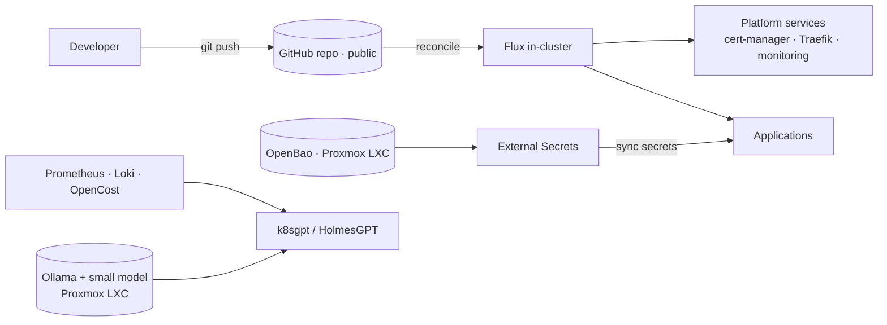

# Homelab Platform — Architecture

A reproducible, GitOps-driven Kubernetes platform running on self-hosted Proxmox
hardware. Built entirely with open-source tooling at **zero recurring cost**, and
deliberately shaped to mirror real production patterns.

---

## Goals & Constraints

- **Purpose** — demonstrate production-grade platform engineering end to end: IaC,
  GitOps, secrets management, observability, and AIOps.
- **100% open-source, $0 recurring** — no managed cloud services, no paid SaaS.
- **Production-shaped** — every layer mirrors a pattern used in real environments,
  kept as simple as that allows.
- **Reproducible** — the whole platform can be destroyed and rebuilt from this repo.

---

## Environment

| | |
|---|---|
| Virtualization | Proxmox VE (no-subscription), AMD Ryzen APU — 8c/16t, 28 GB RAM |
| Cluster | k3s, 3 nodes — **1 server + 2 agents** (Ubuntu 24.04) |
| Capacity | ~6 vCPU / ~15 GB RAM across the cluster |
| Networking | Flannel CNI (k3s default), pod CIDR `10.42.0.0/16` |

> Node IPs and other host-specific values live in **gitignored** var files — see
> [Security](#security--sensitive-data-handling).

---

## Architecture Decisions

| Layer | Choice | Why |
|---|---|---|
| **IaC** | Terraform (Proxmox) + Ansible (k3s bootstrap) | Cluster is reproducible from code |
| **GitOps** | Flux, via `flux bootstrap github` | Git is the single source of truth; Flux self-manages |
| **CNI** | Flannel (k3s default) | Simple, already running; Cilium parked as a later upgrade |
| **Ingress** | Traefik (ships with k3s) | Works out of the box; formalized via GitOps |
| **TLS / PKI** | cert-manager, internal self-signed CA | LAN-only; no public domain needed |
| **Secrets** | External Secrets Operator + self-hosted OpenBao | Mirrors a real ESO + cloud-secrets-manager setup, kept $0 |
| **Observability** | kube-prometheus-stack + Loki + OpenCost | Metrics, logs, and on-prem cost/right-sizing |
| **AIOps** | k8sgpt / HolmesGPT + self-hosted LLM (Ollama) | Plain-English troubleshooting and cost insight |
| **CI** | GitHub Actions | gitleaks scan, `terraform validate`, manifest lint |
| **Registry** | GitHub Container Registry (`ghcr.io`) | Free for public images |

---

## Repository Layout

```text
homelab-platform/
├── ARCHITECTURE.md
├── infra/
│   ├── terraform/        # Proxmox VMs
│   └── ansible/          # k3s bootstrap
├── clusters/homelab/     # flux bootstrap target (gotk-* manifests land here)
│   ├── platform.yaml
│   └── apps.yaml
├── platform/             # platform services: cert-manager, ingress, monitoring, ESO
│   ├── controllers/
│   └── configs/
└── apps/                 # workloads
```

Separating `infra/` (how the cluster *exists*) from the GitOps directories (what
*runs* on it) keeps provisioning and platform concerns cleanly decoupled.

---

## How It Works



1. **Terraform** creates the VMs; **Ansible** installs k3s.
2. `flux bootstrap github` installs Flux and points it at this repo — the **last
   manual `kubectl` you run**.
3. Flux reconciles `clusters/homelab/`, pulling in everything under
   `infrastructure/` and `apps/`. From here, every change is a Git commit.
4. Secret-bearing workloads use **ExternalSecret** resources; ESO fetches the real
   values from **OpenBao** (running outside the cluster).
5. The **AIOps agent** reads telemetry and calls a **self-hosted LLM** to surface
   issues, remediation hints, and cost/right-sizing insight.

> Stateful services that must survive a cluster rebuild — **OpenBao** and the
> **LLM runtime** — run in Proxmox LXCs *outside* the cluster, mirroring how a
> cloud secrets manager sits external to a production cluster.

---

## Security & Sensitive-Data Handling

The repo is **public**, so nothing sensitive is ever committed:

- **Gitignored:** `*.tfstate*` (plaintext state), `*.tfvars` (host IPs/config),
  `kubeconfig`, `.env`. Committed `*.example` files document the expected shape.
- **No secrets in Git** — values live in OpenBao and are pulled at runtime via ESO.
- **gitleaks** runs as a pre-commit hook *and* in CI to block accidental leaks.
- **Internal CA** keeps TLS fully on-LAN with no public exposure.

*Future hardening:* migrate OpenBao auth to Kubernetes auth, add network policies
(requires the Cilium upgrade).

---

## Roadmap

| Phase | Deliverable |
|---|---|
| **1 — Foundation** | Terraform + Ansible reproduce the cluster; destroy/rebuild verified |
| **2 — GitOps** | `flux bootstrap`; Git becomes source of truth |
| **3 — Platform services** | cert-manager (internal CA) + formalized Traefik ingress |
| **4 — Observability** | kube-prometheus-stack + Loki + OpenCost; one real dashboard + alert |
| **5 — App + secrets** | Deploy a real app; stand up ESO + OpenBao; add a self-service "golden path" |
| **6 — AIOps agent** | Self-hosted LLM + k8sgpt/HolmesGPT for troubleshooting & cost insight |

---

## Parked / Future Work

- **HA control plane** — grow from 1 to 3 k3s servers (embedded etcd).
- **Cilium CNI** — eBPF networking, enforced NetworkPolicies, Hubble flow visibility.
- **Longhorn** — distributed persistent storage for stateful workloads.
- **Public TLS** — DuckDNS + Let's Encrypt (DNS-01), if anything is ever exposed.

---

## Rebuild Runbook

The platform's headline property — recover the entire stack from zero:

1. `terraform apply` → VMs provisioned.
2. `ansible-playbook site.yml` → k3s installed.
3. `flux bootstrap github …` → Flux reconciles the platform from this repo.
4. Apply the ESO ↔ OpenBao auth credential (the one out-of-band secret).
5. Flux converges the cluster to the desired state — **hands off**.

> OpenBao and the LLM LXC are independent of the cluster, so their data survives a
> full `terraform destroy` of the Kubernetes nodes.
