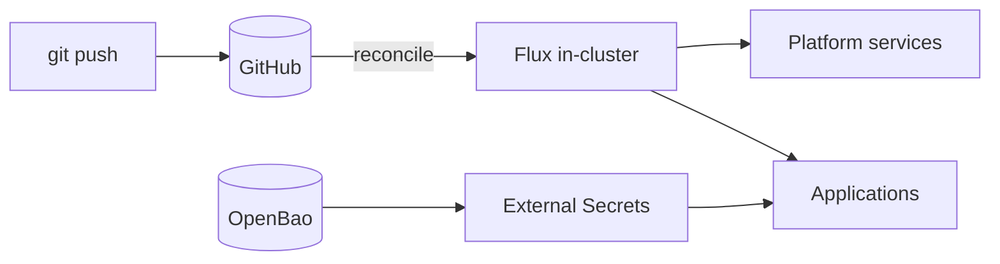

# Homelab Platform

A GitOps-driven Kubernetes platform on self-hosted Proxmox hardware — built with
100% open-source tooling at **zero recurring cost**, deliberately shaped to mirror
real production patterns.

> Portfolio project demonstrating end-to-end platform engineering: IaC, GitOps,
> secrets management, observability, and AIOps.
> Full design → **[ARCHITECTURE.md](./ARCHITECTURE.md)**.

## Why

- **Production-shaped** — every layer mirrors a real-world pattern, kept as simple as that allows.
- **Reproducible** — the whole platform can be destroyed and rebuilt from this repo.
- **$0 / open-source** — no managed cloud services, no paid SaaS.

## Stack

| Layer | Tool |
|---|---|
| Compute | Proxmox VE + k3s (1 server / 2 agents, Ubuntu 24.04) |
| IaC | Terraform (VMs) + Ansible (k3s bootstrap) |
| GitOps | Flux |
| Ingress / TLS | Traefik + cert-manager (internal CA) |
| Secrets | External Secrets Operator + OpenBao |
| Observability | kube-prometheus-stack + Loki + OpenCost |
| AIOps | k8sgpt / HolmesGPT + self-hosted LLM (Ollama) |

## How it works



Terraform provisions the VMs, Ansible installs k3s, then `flux bootstrap` hands the
cluster to Git — every change after that is a commit.

## Layout

```text
infra/terraform/   # Proxmox VMs
infra/ansible/     # k3s bootstrap
clusters/homelab/  # Flux entry point (bootstrap target)
platform/          # platform services: cert-manager, ingress, monitoring   (planned)
apps/              # application workloads                                   (planned)
docs/              # runbooks
```

## Status

**Phase 1 — Foundation:** ✅ complete — Terraform + Ansible reproduce the k3s cluster
(destroy/rebuild verified). **Phase 2 — GitOps:** in progress — Flux directory structure
scaffolded; `flux bootstrap` next.
Roadmap: Foundation → GitOps → Platform services → Observability → App + secrets → AIOps.

## Security

Nothing sensitive is committed: host IPs, Terraform state, and kubeconfig are
gitignored; secrets live in OpenBao and are pulled at runtime via External Secrets.
Details → [ARCHITECTURE.md](./ARCHITECTURE.md#security--sensitive-data-handling).
